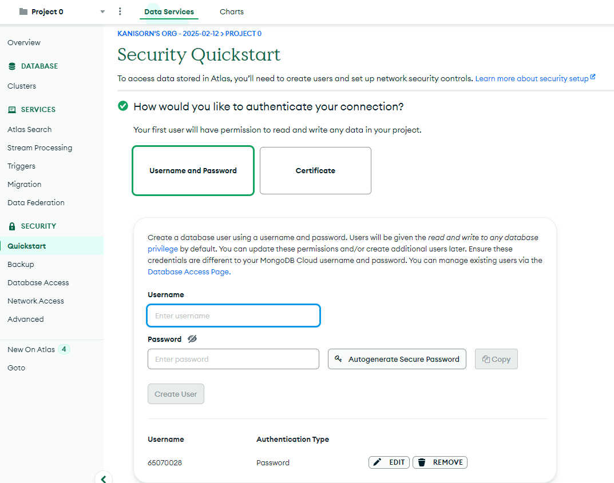

<h1 style="font-weight: bolder; font-size: xxx-large; text-align: center">DC-Station 🏠</h1>

**โครงงาน DC Station** เป็นระบบช่วยจัดหาบ้านให้สัตว์เลี้ยงของแพลตฟอร์มเว็บไซต์ โดยมีบริการร้องขอการรับเลี้ยง มีวัตถุประสงค์เพื่อทำให้สัตว์เลี้ยงหาบ้านที่มีความสะดวกและได้บ้านที่อบอุ่นจริง ๆ โดยเฉพาะอย่างยิ่งสำหรับกลุ่มเป้าหมายคือบุคคลที่มีความเมตตาต่อสัตว์โลก 🐾

---

## 📦 Technology (เทคโนโลยีที่ใช้)

- **Next.js** :

  - เป็น **React Framework** ที่ช่วยให้การพัฒนาเว็บแอปพลิเคชันง่ายขึ้น โดยเน้นเรื่อง Performance, SEO และ Developer Experience มันถูกออกแบบมาให้สามารถทำงานได้ทั้ง Server-Side Rendering (SSR) และ Static Site Generation (SSG) รวมถึงรองรับ API Routes และ Full-Stack Development ภายในตัวเอง

  - มีการเรียกใช้ **Library Motion** ที่ช่วยในการทำให้หน้าบ้านมีลูกเล่นมากขึ้น โดยการกำหนด Animation ให้กับ Element และทำให้ Element นั้นเคลื่อนไหวและปรับเปลี่ยนตามโครงสร้างหน้าบ้าน

  - และการใช้งาน **Library CKEditor** ทำให้เขียนเอกสารภายในหน้าเว็บแล้วสามารถแปลงเป็น Tag HTML ได้ ซึ่งใช้ในการเพิ่มข้อมูลเกร็ดความรู้ภายในระบบของเรา

- **Tailwind CSS Framework** : เป็น tool ที่ช่วยให้ตกแต่งรายละเอียดของ CSS ได้อย่างง่าย ลดกระบวนการที่นักพัฒนาเข้าไปแก้ไขที่ไฟล์ CSS หลัก ข้อดีหลักๆของ Tailwind CSS คือทำให้ลดขนาดของไฟล์ CSS ได้ระดับนึง เพราะสามารถเขียน style ในไฟล์ HTML แบบ Inline ได้เลย โดยวิธีการนี้จะทำให้หน้าเว็บเพจโหลดเร็วขึ้น

- **Express.js** : Framework สำหรับการเขียนการทำงานฝั่ง **Backend** โดยใช้เพื่อทำ REST API, Model, Routes และ Authentication เชื่อมเข้ากับ MongoDB Atlas ผ่าน Library Mongoose

- **MongoDB** : เป็นฐานข้อมูลแบบ **NoSQL** เก็บข้อมูลในรูปแบบของ Document มีความยืดหยุ่นสูงในการเก็บข้อมูล ซึ่งในระบบนี้จะมีการอ่านที่เยอะกว่าเขียน และโครงสร้างข้อมูลบางส่วนไม่เหมือนกัน ทำให้ MongoDB เหมาะที่จะปรับใช้เข้ากับระบบจัดหาบ้านให้สัตว์เลี้ยง

- **Mongoose\*** : มีหน้าที่หลักในการ**แปลง Schema** ที่ถูกเขียนอยู่ในรูปแบบโค้ดให้เป็น Schema Object ใน MongoDB ทำให้ผู้ใช้ไม่จำเป็นต้องเข้าไปแก้ Schema ใน MongDB โดยตรง และทำการ**ตรวจสอบความถูกต้องของข้อมูลตาม Schema** ที่กำหนดให้โดยอัตโนมัติเมื่อมีการ Insert ข้อมูล

- **Bcrypt** : Library สำหรับทำการ**เข้ารหัส Password**

---

## 🛢️ Database (ฐานข้อมูล)

\*ตาราง users : ข้อมูลบัญชีผู้ใช้ที่มีสิทธิ์เข้าหน้า Dashboard (ในบทบาทนี้คือเจ้าหน้าที่ DC Staion)


## 🛠️ How to install (วิธีติดตั้งโปรเจค)

### 1️⃣ ดาวน์โหลด Source Code

ให้โหลดซอร์สโค้ดโปรเจคลงในเครื่อง


### 2️⃣ ติดตั้ง Node.js

ต้องมี Node.js ติดตั้งบนเครื่องก่อนเพื่อให้สามารถรันโปรเจคได้


### 3️⃣ ตั้งค่า Environment Variables

เมื่อทำการโหลด `Source Code` เรียบร้อย เปลี่ยนชื่อไฟล์ `.env.example` เป็น `.env` และแก้ไขข้อมูล [ที่มาของ Environment Variables](#setting-environment-variables)

```env
# YOUR_MONGO_URL
MONGO_URL=

# YOUR_SECURE_CHARACTER_FOR_JWT
JWT_SECRET=

# CKEDITOR_TOKEN
NEXT_PUBLIC_CK_LICENSEKEY=

# YOUR_PORT_TO_BACKEND
NEXT_PUBLIC_BACKENDPORT= # 1234

# YOUR_SECURE_CHARACTER_FOR_AUTH_SECRET
AUTH_SECRET=

# IS PRODUCTION
AUTH_TRUST_HOST= # true or false
```

### ▶️ Run Project

#### 1️⃣ ติดตั้ง Dependencies

```bash
npm install
```

#### 2️⃣ Build & Run Project

หากลงเสร็จแล้วให้ทำการ Build Express and Next Project (หากมีการแก้ไขข้อมูลภายในไฟล์ `.env` ต้องมีการรันคำสั่งอีก)

```bash
npm run publish:build
```

หากครั้งต่อไปต้องการจะรันโปรเจคขึ้นมาใหม่ สามารถใช้คำสั่ง เพื่อความรวดเร็วในการใช้งาน

```bash
npm run publish
```

สามารถเข้าใช้งานได้ที่ [localhost:3000](http://localhost:3000)

โดยจะขึ้นหน้าเว็บไซต์แบบนี้ หากดำเนินการติดตั้งสำเร็จ


### 🛠️ เพิ่มข้อมูล Users ในฐานข้อมูล (Manager)

ใช้ `POST` ไปที่ `localhost:[backendport]/api/auth/register` พร้อมส่ง JSON:

```json
{
  "email": "test@mail.com",
  "password": "12345678"
}
```

สามารถใช้เครื่องมือเช่น **insomnia**, **postman** เพื่อส่ง Request


หลังจากนี้ก็จะสามารถเข้าใช้งานในฐานะ `Manager` ได้

📌 หลังจากดำเนินการตามขั้นตอนทั้งหมดนี้ จะสามารถเข้าใช้งานระบบได้สมบูรณ์ 🚀

## 🛠️ Install and Run (Alternative)

เราต้องทำการติดตั้ง Docker เข้ามาในเครื่องก่อน


สามารถใช้ `docker compose` ในการติดตั้งโปรเจคเพื่อใช้งาน Website ได้ ผ่านการใช้งาน

```bash
docker compose up
```

📌 และสามารถเปิดใช้งาน [http://localhost:3000](http://localhost:3000) ได้เลย 🚀

## 🌟 Sample Webiste (ตัวอย่างเว็บไซต์)

<h2 style="font-weight: bolder; font-size: xx-large; text-align: center">👤 ผู้รับเลี้ยง (Guest)</h2>

### `🏠 Home (หน้าหลัก)`

<section style="display: grid; grid-template-columns: repeat(2, minmax(0, 1fr)); justify-items: center;gap: 10px">
    
    
    
</section>

### `🐶 Find House (หน้าน้องหาบ้าน)`

<section style="display: grid; grid-template-columns: repeat(1, minmax(0, 1fr)); justify-items: center;">
    
    
    
    
</section>

### `📚 Knowledges (หน้าเกร็ดความรู้)`


### `📞 Contact (หน้าติดต่อสอบถาม)`


<hr/>

<h2 style="font-weight: bolder; font-size: xx-large; text-align: center">🧑‍💼 ผู้ดูแล (Manager)</h2>

### `🔑 Sign in (หน้าเข้าสู่ระบบ)`

การจะเข้าถึงได้ต้องมีการล็อคอินผ่าน URL /login เสียก่อน มีการดึงข้อมูลจากฐานข้อมูล users มาเช็คในการเข้าถึงระบบ [http://localhost:3000/login](http://localhost:3000/login)


### `📊 Manage Dashboard (หน้าจัดการแดชบอร์ด)`


### `📝 Manage Requests (หน้าจัดการคำร้องขอรับเลี้ยง)`


### `🐾 Manage Animals (หน้าจัดการสัตว์)`


### `📚 Manage Knowledges (หน้าจัดการเกร็ดความรู้)`


## ⚠️ Troubleshoot


หากหน้าเว็บขึ้นแบบนี้ให้ทำการดูที่ CLI ว่าขึ้นแบบนี้หรือไม่

```bash
Server running on port xxxx
MongoDB Connected
```

หากไม่มีให้ทำตามดังนี้

- ดูที่ไฟล์ `.env` ว่ากำหนดค่า `MONGO_URL` ถูกต้องหรือป่าว
- มีการตั้งค่า Network Access ที่มี IP Address ของเครื่องอยู่หรือไม่

# 📣 ผู้จัดทำโครงการ

[](https://github.com/bess11234)

- @bess11234

[](https://github.com/KKMAI)

- @KKMAI

<br/>

<hr/>

# Setting Environment Variables

## 📌 MONGO_URL (ENV)

เราสามารถทำได้ 2 วิธีในการเอาข้อมูล MONGO_URL

1. MongoDB Local Connection

   เราสามารถเข้าไปโหลด MongoDB Compass (GUI) ซึ่งจะติดตั้ง MongoDB ภายในเครื่อง

   

   หลังจากติดตั้งเสร็จสิ้นให้ทำการเปิด MongoDBCompass ขึ้นมา แล้วจะขึ้นหน้าแบบนี้ แล้วทำการกด `Add new connection`

   

   และให้ทำการกด `Save & Connection`

   

   เราก็จะสร้าง MongoDB เรียบร้อยแล้ว หลังจากนั้นให้ทำการสร้าง Create Database

   
   

   หลังจากนั้นให้สร้างให้ครบ Data Model

   

   เมื่อสร้างครบแล้วก็สามารถนำข้อมูล MONGO_URL มาจากการกดที่ `Copy connection string` ได้เลย

   

   หลังจาก Copy แล้วให้นำไปใส่ข้อมูลภายใน `.env`

   ```env
   MONGO_URL=mongodb://localhost:27017/DC_Station
   ```

   หมายเหตุ: **โดยต้องมีการเพิ่ม Database name ซึ่งที่ใช้ก็คือ `DC_Station` ต่อหลังด้วย**

2. MongoDB Atlas (Cloud)

   หากเราต้องการดึงฐานข้อมูลจากบน MongoDB บน Cloud เราต้องทำการ Sign in เข้าไปที่เว็บไซต์ [https://account.mongodb.com/account/login](https://account.mongodb.com/account/login)

   

   หลังจากนั้นเราต้องสร้าง Project ขึ้นมาเพื่อทำการสร้าง Cluster โดยให้เราเลือก Plan ตามความเหมาะสมได้เลย

   

   หลังจากรอสร้าง Cluster เสร็จแล้วให้ทำการกด `Browse Collections`

   

   แล้วให้กด `Add My Own Data` แล้วกรอกข้อมูลดังนี้

   

   หลังจากนั้นให้สร้างให้ครบ Data Model

   

   หลังจากนั้นให้ทำการตั้งค่าที่ `Quick Start` โดยต้องทำการสร้าง User และเพิ่ม IP Address เข้า Network Access

   

   

   เมื่อสร้างครบแล้วให้ทำตามดังนี้

   

   หลังจากนั้นให้ Copy ข้อมูล MONGO_URL

   หมายเหตุ: **ต้องสร้าง Users ให้พร้อมก่อน**

   

   หลังจาก Copy แล้วให้นำไปใส่ข้อมูลภายใน `.env`

   ```env
   mongodb+srv://<db_username>:<db_password>@cluster0.aqsdx.mongodb.net/DC_Station
   ```

   หมายเหตุ: **ต้องแก้ไข \<db_username\>, \<db_password\> เป็นของตัวเอง โดยต้องมีการเพิ่ม Database name ซึ่งที่ใช้ก็คือ `DC_Station` ต่อหลังด้วย**

## 🔐 JWT_SECRET (ENV)

เราสามารถใช้ Website ในการ Generate ข้อมูล JWT Secret จากเว็บ [JwrSecret.com](https://jwtsecret.com/generate)


เพื่อให้เรานำมาใช้ Sign ให้กับ JWT TOKEN เพื่อปกป้องข้อมูล Users ในการเข้าถึงข้อมูล

## 🔑 CK_LICENSEKEY (ENV)

เราต้องทำการ Sign in ในเว็บไซต์ CKEditor [CKEditor](https://ckeditor.com)

โดยข้อมูลของ License key มีให้เลือก 2 ตัวคือ Production, Development ให้เราเลือกตามความเหมาะสม


## 🚀 BACKENDPORT (ENV)

เราสามารถกำหนด PORT ที่จะใช้ได้ตามที่ต้องการ โดยต้องกำหนดให้ไม่ชนกับ PORT ที่มีการใช้งานอยู่แล้ว เช่น `1234`

## 🛡️ AUTH_SECRET (ENV)

เราสามารถเข้าไป Generate ข้อมูล Secret ได้ที่เว็บไซต์นี้เลย [Auth Secret](https://auth-secret-gen.vercel.app)


## 🔄 AUTH_TRUST_HOST (ENV)

- Production: `true`
- Development: `false`
